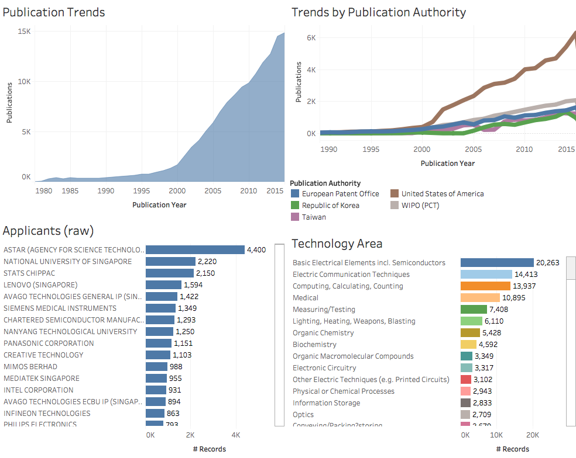

```{r setup, include=FALSE}
knitr::opts_chunk$set(echo = TRUE)
```

## Introduction

In this section we provide a brief overview of patent trends for the ten ASEAN countries. The analysis is based on the use of the World Patent Statistical Database (PATSTAT spring 2016 edition) to identify:

- patent documents originating from the country (based on the country code for applicants and inventors)
- patent documents published within one of the ASEAN countries (publication authority)

### Patent documents originating from ASEAN countries. 

In total we ideantified 109,744 applications associated with the 10 ASEAN countries that were published in the period from 1841 to 2016 (partial data). Note that because the presence of country codes in the applicant and inventor field may be incomplete, counts may be lower than the reality. 

The dashboard below shows overall trends for patent applications with an applicant or inventor originating from one of the ASEAN countries. 

```{r trends, echo=FALSE, fig.align='center', out.width="800px"}

```

